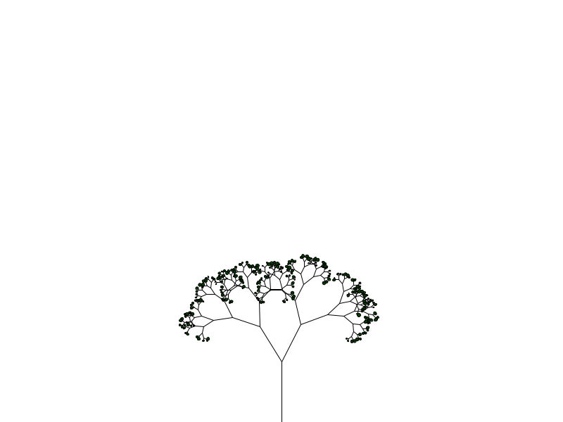

# Fractal_tree
This is a canopy fractal tree simulation. The canopy fractal tree is created by spliting each canooy into two different others based on a minimum and maximum amount of branches. 

<h2> How to use </h2>

  You can tweak with the fractal tree generation by changing the minimum and maximum amount of branches. To regenerate the tree, just press the letter 'r'.

 
The example bellow shows the fractal tree generation based on the minimum amount of 50 branches and the maximum amount of 175 branches.

 

